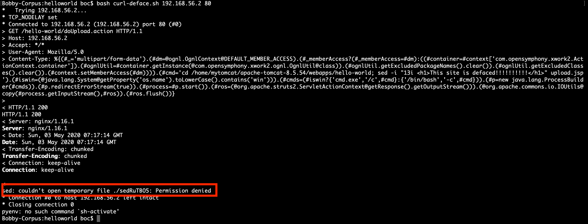
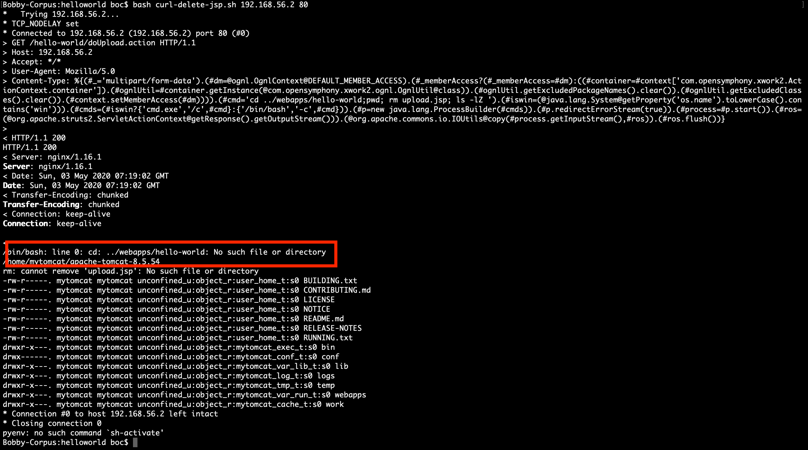
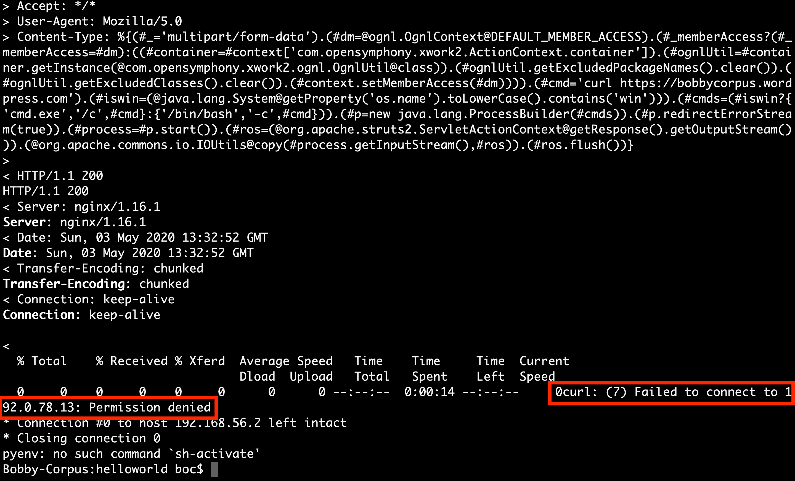

# This is a sample project to demonstrate a vulnerability.


## Setup
### Configure 2 Virtual Box VMs 

- Operating System: Centos 7.7.1908 or later
- Enable NAT and hostonly network
- VM1 ip address 192.168.56.2, netmask 255.255.255.0, hostname permissive
- VM2 ip address 192.168.56.3, netmask 255.255.255.0, hostname enforcing
- Install SELinux dependencies in both VMs


```
yum install -y policycoreutils-python
yum install -y selinux-policy-devel 
yum install -y setools-console
```

- Enable SELinux in VM2

```
setenforce 1
```

  - Edit the file /etc/selinux/config and make sure that the value of SELINUX is set to enforcing

- Set SELinux in VM1 to permissive

```
setenforce 0
```

  - Edit the file /etc/selinux/config and make sure that the value of SELINUX is set to permissive

- Install nginx on both  VMs
  - In the below, let 

  ```<vm ip>``` be equal to 192.168.56.2 if VM = VM1 
  ```<vm ip>``` be equal to 192.168.56.3 if VM = VM2

```
yum install epel-release
yum install nginx
```

- Edit /etc/nginx/nginx.conf and change the line from

```
      location / {
        }
```

to

```
      location / {
          proxy_pass http://<vm ip>:8080;
        }
```

- Enable nginx in both VMs

```
systemctl enable nginx
systemctl restart nginx
```

- In VM2, since SELinux is enabled, it will not allow the nginx to connect to the upstream server at VM2, so we enable a boolean to allow it to do so:

```
setsebool httpd_can_network_connect on
```

- Open ports 80 and 8080 in both VMs

```
firewall-cmd --add-port 80/tcp --permanent
firewall-cmd --add-port 8080/tcp --permanent
firewall-cmd --reload
```

- Create the user mytomcat and set a password

```
adduser -Z user_u mytomcat
passwd mytomcat
```


- As root download the maven binary

```
curl -LO http://mirror.rise.ph/apache/maven/maven-3/3.6.3/binaries/apache-maven-3.6.3-bin.tar.gz
tar xzf apache-maven-3.6.3-bin.tar.gz
mv apache-maven-3.6.3 /usr/local/maven
echo "export PATH=\$PATH:/usr/local/maven/bin" >> /etc/environment
```

- Clone this project and build the war file

```
cd ~
git clone https://github.com/corpbob/struts-vulnerability-demo.git
cd struts-vulnerability-demo
mvn clean package
mv target/hello-world.war ~/
```
- Compile and install the custom SELinux policy for tomcat

```
cd ~/struts-vulnerability-demo
ln -s /usr/share/selinux/devel/Makefile Makefile
make mytomcat.pp
semodule -r mytomcat
semodule -i mytomcat.pp 
```

- Download the tomcat distribution

```
cd ~ && curl -LO http://mirror.rise.ph/apache/tomcat/tomcat-8/v8.5.54/bin/apache-tomcat-8.5.54.tar.gz
cd ~/struts-vulnerability-demo && bash install_tomcat.sh
```

# Start the tomcat

- Login as tomcat 

```
ssh tomcat@192.168.56.3
cd ~/apache-tomcat-8.5.54
./bin/catalina.sh run
```
 
- Now you can test via a browser by navigating to http://192.168.56.3/hello-world. You can try to upload a file
- Open another terminal and execute the curl.sh command

# Run the exploit on the Permissive. 

## Get the password file
***Note that 192.168.56.3 is the reverse proxy to the permissive VM.***

```
bash curl.sh 192.168.56.3 80
```


## Deface the site. 

```
bash curl-deface.sh 192.168.56.3 80
```


- Reload the browser at http://192.168.56.3/hello-world/ and notice that you defaced the site.

### Delete a jsp

```
bash curl-delete-jsp.sh 192.168.56.3 80
```


# Run the exploit on the SELinux Enforcing. 

## Get the password file
***Note that 192.168.56.2 is the reverse proxy to the enforcing VM.***

```
bash curl.sh 192.168.56.2 80
```

You will notice this will also give the password file. Good thing is that the attacker is not able to view the shadow file which you can verify by editing the curl.sh file.

## Deface the site.

```
bash curl-deface.sh 192.168.56.2 80
```



As you can see from the above, we got a permission denied.

- Reload the browser at http://192.168.56.2/hello-world/ and notice the site is not defaced.

### Delete a jsp

```
bash curl-delete-jsp.sh 192.168.56.2 80
```



As you can see, we also get a permission denied.

# Using Custom User

- In the above steps, we made use of the user_u SELinux user. However, we can create a customer user based on the "guest_u" user which is more restrictive (It can't connect to the internet to download scripts.)

- Stop the tomcat process and log-off the mytomcat user.
- Delete the mytomcat user

```
userdel -r mytomcat
semanage login -d -s user_u mytomcat 
```
- Create another mytomcat user from scratch

```
adduser mytomcat
passwd mytomcat
```

- Create the mytomcatadm user module. The file mytomcatadm.te defines the mytomcatadm_r and mytomcatadm_t. Compile and install.

```
make mytomcatadm.pp
semodule -r mytomcatadm
semodule -i mytomcatadm.pp
```

- Verify  we have the

```
seinfo -t|grep mytomcatadm
seinfo -r|grep mytomcatadm
```

- Edit the file /etc/selinux/targeted/contexts/default_type and add the new type

```
cat /etc/selinux/targeted/contexts/default_type

auditadm_r:auditadm_t
secadm_r:secadm_t
sysadm_r:sysadm_t
guest_r:guest_t
xguest_r:xguest_t
staff_r:staff_t
unconfined_r:unconfined_t
user_r:user_t
mytomcatadm_r:mytomcatadm_t
```

- Copy the guest_u user file to mytomcatadm_u

```
cp /etc/selinux/targeted/contexts/users/guest_u /etc/selinux/targeted/contexts/users/mytomcatadm_u
```

- Change guest_t and guest_r to mytomcatadm_t and mytomcatadm_r

```
vi /etc/selinux/targeted/contexts/users/mytomcatadm_u
```

- Map the user to the role

```
semanage user -a -R "mytomcatadm_r" mytomcatadm_u
```

- Map the user login to the selinux user

```
semanage login -a -s mytomcatadm_u mytomcat 
```

- Relabel the files of the user

```
restorecon -RvF /home/mytomcat
```

- Install Tomcat (link here)

```
cd ~ && curl -LO http://mirror.rise.ph/apache/tomcat/tomcat-8/v8.5.54/bin/apache-tomcat-8.5.54.tar.gz
cd ~/struts-vulnerability-demo && bash install_tomcat.sh
```

- Login as mytomcat. You need to login using a terminal because the mytomcatadm_u user cannot login using ssh. (It inherited from the "guest_r" role).

- Start tomcat

```
cd ~/apache-tomcat-8.5.54
./bin/catalina.sh run
```

- Test that we cannot download from the internet

```
bash curl-connect-to-net.sh 192.168.56.2 80
```


# Notes
- Remove tools that allow the attacker to download files, for example:
  - wget
  - curl
  - git
- Remove tools that allow the attacker to compile executables:
  - gcc
  - javac

# References
* [1] https://www.synopsys.com/blogs/software-security/equifax-apache-struts-vulnerability-cve-2017-5638/
* [2] https://nvd.nist.gov/vuln/detail/CVE-2017-5638#vulnCurrentDescriptionTitle
* [3] https://blog.trendmicro.com/trendlabs-security-intelligence/cve-2017-5638-apache-struts-vulnerability-remote-code-execution/#gallery-1
* [4] https://blog.talosintelligence.com/2017/03/apache-0-day-exploited.html
* [5] https://github.com/xsscx/cve-2017-5638
* [6] https://www.itzgeek.com/how-tos/linux/centos-how-tos/how-to-install-apache-tomcat-9-on-rhel-8.html#SELinux
* [7] https://wiki.gentoo.org/wiki/SELinux/Tutorials/Creating_a_user_domain
