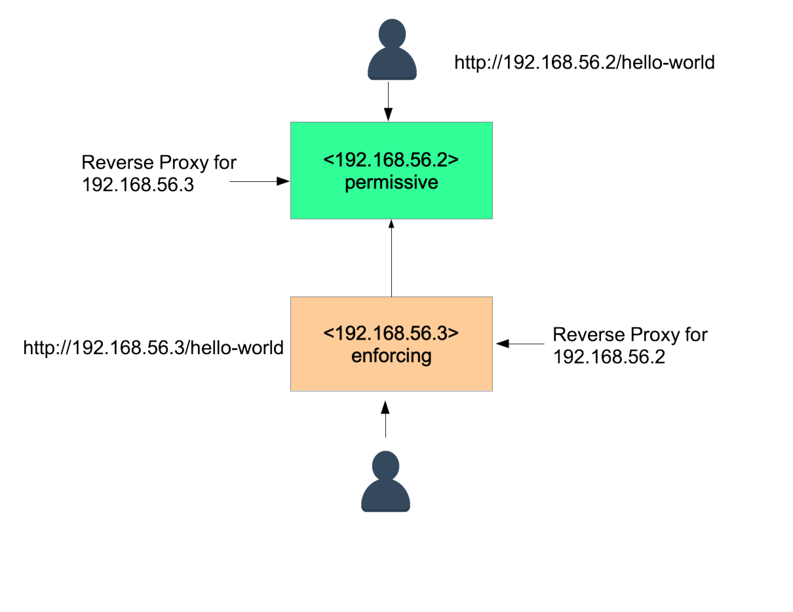
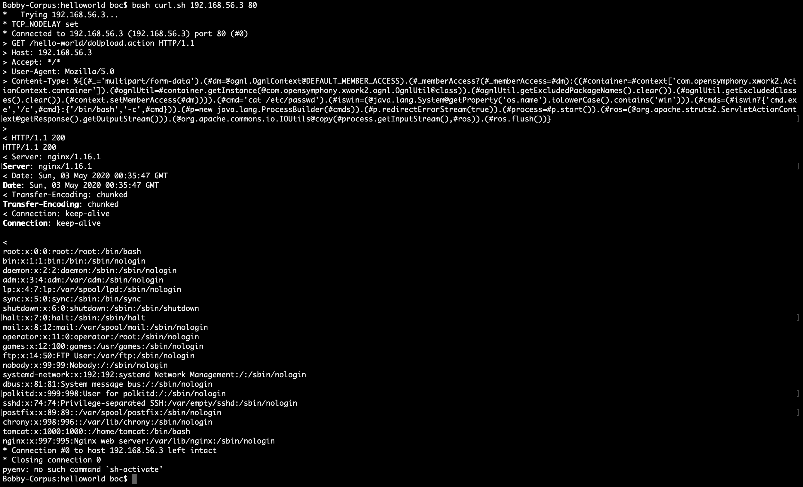

# This is a sample project to demonstrate a vulnerability.


## Setup
### Configure 2 Virtual Box VMs 

- Operating System: Centos 7.7.1908 or later
- Enable NAT and hostonly network
- VM1 ip address 192.168.56.2, netmask 255.255.255.0, hostname permissive
- VM2 ip address 192.168.56.3, netmask 255.255.255.0, hostname enforcing
- Install SELinux dependencies in both VMs


```
yum install -y policycoreutils-python
yum install -y selinux-policy-devel 
yum install -y setools-console
```

- Enable SELinux in VM2

```
setenforce 1
```

  - Edit the file /etc/selinux/config and make sure that the value of SELINUX is set to enforcing

- Set SELinux in VM1 to permissive

```
setenforce 0
```

  - Edit the file /etc/selinux/config and make sure that the value of SELINUX is set to permissive

- Install nginx on both  VMs
  - In the below, let 

  ```<vm ip>``` be equal to 192.168.56.2 if VM = VM1 
  ```<vm ip>``` be equal to 192.168.56.3 if VM = VM2

```
yum install epel-release
yum install nginx
```

- Edit /etc/nginx/nginx.conf and change the line from

```
      location / {
        }
```

to

```
      location / {
          proxy_pass http://<vm ip>:8080;
        }
```

- Enable nginx in both VMs

```
systemctl enable nginx
systemctl restart nginx
```

- In VM2, since SELinux is enabled, it will not allow the nginx to connect to the upstream server at VM2, so we enable a boolean to allow it to do so:

```
setsebool httpd_can_network_connect on
```

- Open ports 80 and 8080 in both VMs

```
firewall-cmd --add-port 80/tcp --permanent
firewall-cmd --add-port 8080/tcp --permanent
firewall-cmd --reload
```

- Create the user mytomcat and set a password

```
adduser mytomcat
passwd mytomcat
```


- As root download the maven binary

```
curl -LO http://mirror.rise.ph/apache/maven/maven-3/3.6.3/binaries/apache-maven-3.6.3-bin.tar.gz
tar xzf apache-maven-3.6.3-bin.tar.gz
mv apache-maven-3.6.3 /usr/local/maven
echo "export PATH=\$PATH:/usr/local/maven/bin" >> /etc/environment
```

- Clone this project and build the war file

```
cd ~
git clone https://github.com/corpbob/struts-vulnerability-demo.git
cd struts-vulnerability-demo
mvn clean package
mv target/hello-world.war ~/
```
- Compile and install the custom SELinux policy for tomcat

```
cd ~/struts-vulnerability-demo
ln -s /usr/share/selinux/devel/Makefile Makefile
make mytomcat.pp
semodule -r mytomcat
semodule -i mytomcat.pp 
```

- Download the tomcat distribution

```
cd ~ && curl -LO http://mirror.rise.ph/apache/tomcat/tomcat-8/v8.5.54/bin/apache-tomcat-8.5.54.tar.gz
cd ~/struts-vulnerability-demo && bash install_tomcat.sh
```

# Start the tomcat

- Login as tomcat 

```
ssh tomcat@192.168.56.3
cd ~/apache-tomcat-8.5.54
./bin/catalina.sh run
```
 
- Now you can test via a browser by navigating to http://192.168.56.3/hello-world. You can try to upload a file
- Open another terminal and execute the curl.sh command

# Run the exploit on the Permissive. 

## Get the password file
***Note that 192.168.56.3 is the reverse proxy to the permissive VM.***

```
bash curl.sh 192.168.56.3 80
```


## Deface the site. Edit the file curl.sh and change 

```
bash curl-deface.sh 192.168.56.3 80
```


- Reload the browser at http://192.168.56.3/hello-world/ and notice that you defaced the site.

### Delete a jsp

```
bash curl-delete-jsp.sh 192.168.56.3 80
```


# Notes
- Remove tools that allow the attacker to download files, for example:
  - wget
  - curl
  - git
- Remove tools that allow the attacker to compile executables:
  - gcc
  - javac

# References
* [1] https://www.synopsys.com/blogs/software-security/equifax-apache-struts-vulnerability-cve-2017-5638/
* [2] https://nvd.nist.gov/vuln/detail/CVE-2017-5638#vulnCurrentDescriptionTitle
* [3] https://blog.trendmicro.com/trendlabs-security-intelligence/cve-2017-5638-apache-struts-vulnerability-remote-code-execution/#gallery-1
* [4] https://blog.talosintelligence.com/2017/03/apache-0-day-exploited.html
* [5] https://github.com/xsscx/cve-2017-5638
* [6] https://www.itzgeek.com/how-tos/linux/centos-how-tos/how-to-install-apache-tomcat-9-on-rhel-8.html#SELinux
